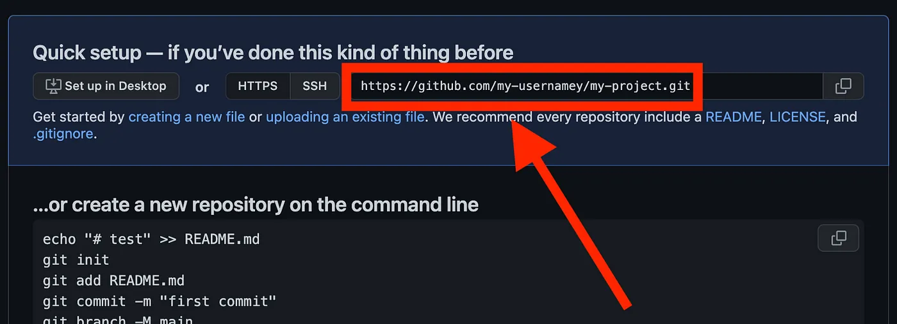
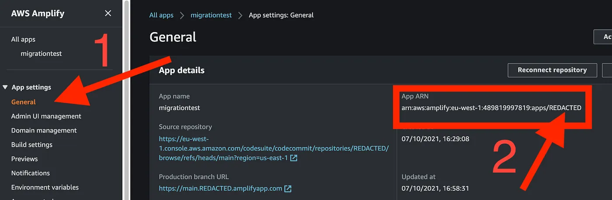
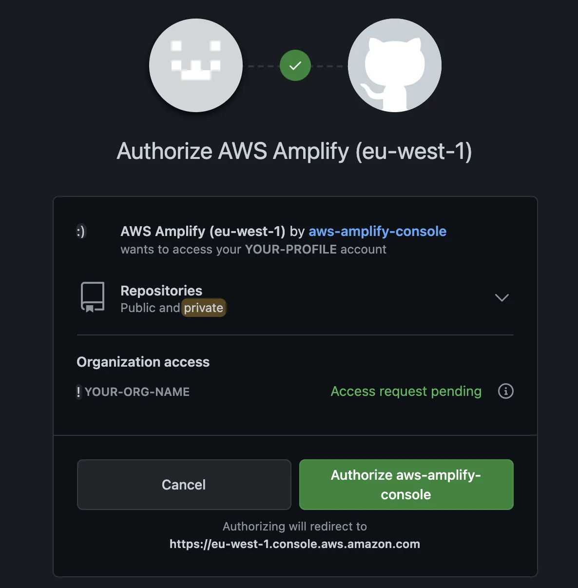
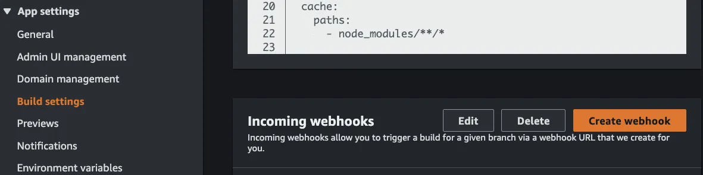
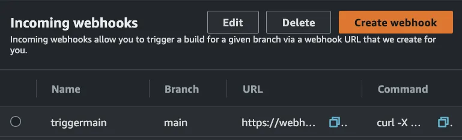
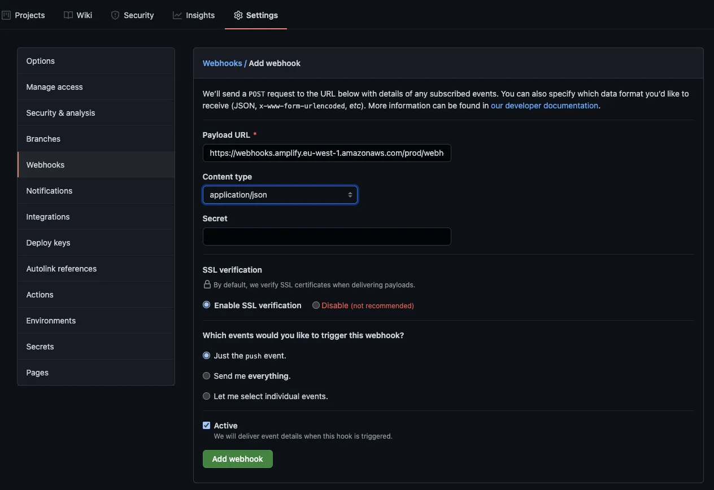

Este tutorial inclui orientações para três cenários de administração no GitHub:

1. Quando o repo está na sua conta pessoal;
2. Quando o repo está dentro de uma organização no GitHub e a galera da administração te dá as permissões necessárias; e
3. Quando o repo está dentro de uma organização no GitHub e a galera da administração NÃO te dá as permissões necessárias.

_Pré-requisitos: Acesso e permissões relevantes para CodeCommit e Amplify. Você também precisa de uma conta ativa no GitHub._

<!--truncate-->

## Migrando o Repo

1. Abra o terminal e faça cd para a pasta onde está o repo do CodeCommit.
2. Execute `git remote get-url origin` para obter o URL para clonar o projeto a ser migrado para o GitHub.
3. Crie uma pasta temporária executando `mkdir ../temp-clone` e abra-a na CLI executando `cd ../temp-clone`.
4. Execute `git clone --bare` seguido do URL que você pegou na etapa 2. Um exemplo seria `git clone --bare <https://git-codecommit.eu-west-1.amazonaws.com/v1/repos/nome-do-diretorio-do-codecommit>`.

<br/>

:::note Nota Educativa

O sufixo (flag) `--bare` é uma forma de clonar o repo cortando todos os vínculos com o remoto (CodeCommit, neste caso). Você ainda vai ter todos os branches, tags e tal, mas o repo clonado fica completamente independente do remoto.

:::

<br/>

5. Crie um novo repo no GitHub. Para evitar problemas, não adicione nenhum README, .gitignore nem nada. Depois de clicar em “Create repo” (Criar repo), a única coisa a fazer é copiar o URL como mostrado abaixo. Não execute nenhum git init, não faça um commit inicial, nada. Só copia o link.

<br/>



<br/>

6. Voltando ao terminal, execute `cd nome-do-diretorio-do-codecommit.git`, e depois faça um push mirror seguido pelo URL que você obteve na etapa 5. No exemplo acima, o comando seria `git push --mirror <https://github.com/my-username/my-project.git>`.

É isso, a migração acabou.

### Confirme

Para confirmar que deu tudo certo, volte ao GitHub e atualize a página. O repo vai estar todo bonitinho lá, com histórico de commits, as branches e o resto todo.  
Para usar repo migrado para o GitHub, é só fazer o clone de sempre e seguir com a vida :)

### Arrume

Se você seguiu as instruções, agora é hora de excluir sua pasta temporária. Volte para o terminal e execute `cd ../..` e `rm -rf temp-clone`. Se você usou a pasta tmp do sistema operacional, pode pular essa etapa.


## Redirecionando a pipeline do Amplify

Agora que você migrou o código para o GitHub, como você mantém a pipeline Amplify que estava ligada ao repo no CodeCommit?

### Execute o comando `update-app`
```
AWS_PROFILE=PERFIL AWS_DEFAULT_REGION=REGIÃO aws amplify update-app --app-id AMPLIFY_APP_ID --repository REPOSITORY_URL --access-token ACCESS_TOKEN
```

`AMPLIFY_APP_ID`: para encontrar a ID da sua aplicação, acesse o console do Amplify. Em App settings (Configurações do aplicativo), clique em General (Geral) e procure o ARN da aplicação. A ID da aplicação é a sequência alfanumérica no final do ARN. A ID é mostrada como REDACTED na imagem abaixo:

<br/>



<br/>

`REPOSITORY_URL`: É o URL que você usou na etapa 5 da migração.  
`ACCESS_TOKEN`: o token de acesso é um token que você pode gerar no GitHub. Pode ser o PAT (token de acesso pessoal) de quem administra o repo, mas se for um projeto profissional, prefira usar um [token de acesso do usuário gerado por um app no GitHub](https://docs.github.com/pt/apps/creating-github-apps/authenticating-with-a-github-app/generating-a-user-access-token-for-a-github-app).

### Reautentique o app Amplify

:::tip XP da vida real

As empresas podem restringir bastante quais apps são aprovados no GitHub. Se por algum motivo o app Amplify não for aprovado, pule para a seção ["A abordagem via Webhook"](#a-abordagem-via-webhook).
:::

Agora você pode reconectar sua aplicação. Na mesma página em que obteve o ARN, acima do ARN tem o botão “Reconnect repository” (Reconectar repositório). Ao clicar nele, a página de aprovação no GitHub é aberta.

- **Se o repositório migrado NÃO estiver em uma Organização**, clique no botão “Authorize aws-amplify-console” (Autorizar aws-amplify-console). O console do Amplify vai abrir, e lá você pode selecionar o repo. Pronto, fim.
- **Se o repositório migrado estiver em uma Organização**, clique no botão para solicitar a permissão OAuth para o app Amplify. Uma mensagem de solicitação pendente fica disponível até que a administração a aprove (você vai receber um e-mail quando isso acontecer).

<br/>



<br/>

Depois da aprovação, volte para o app Amplify e clique em “Reconnect repository” (Reconectar repositório) novamente. Os repos da sua organização e da sua própria conta aparecem, para você escolher um deles. Fim.

### A Abordagem via Webhook

Se você não puder usar o app Amplify no GitHub, você pode usar um webhook. Para isso, em App settings (Configurações do aplicativo), clique em General (Geral), selecione Build Settings (Configurações de compilação) e clique em Create Webhook (Criar Webhook),  ambos mostrados em laranja abaixo.

<br/>



<br/>

No pop-up, digite um nome e selecione um branch para fazer o build. O novo webhook será exibido na interface do Amplify. Copie o URL porque vamos precisar dele no GitHub.

<br/>



<br/>

Agora volte para o repo no GitHub, selecione Configurações > Webhooks e clique no botão Add webhook (Adicionar webhook).

<br/>



Acabou, finalmente.

### Limitações do webhook

Se você usar o webhook, lembre-se de que:

- Se precisar conectar vários branches ao Amplify, você vai precisar de um webhook no Amplify para cada branch, e vai precisar adicionar cada webhook ao GitHub, um por um. Se bater a tentação de fazer um script, converse com a galera que faz admin do Github na sua empresa e tenta aprovar o app Amplify. Ninguém merece viver na gambiarra.  
- Qualquer git push vai espuletar o webhook em cada deploy no Amplify. Em outras palavras, se você tiver as branches “main”, “release”, “dev”, “feature/a” e “feature/b”, toda vez que alguém fizer um push em “dev”, a pipeline vai espuletar em todas as cinco branches.

Espero ter sido útil, até mais!
