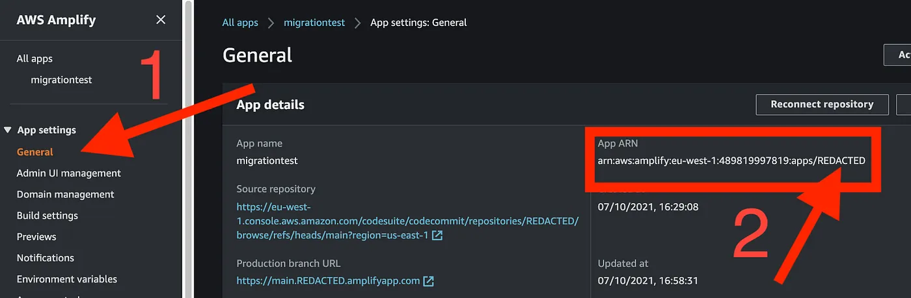
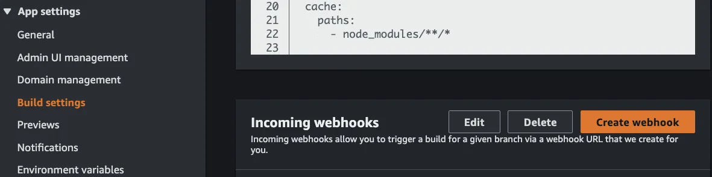
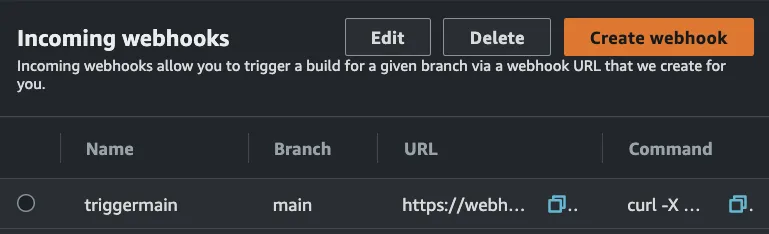
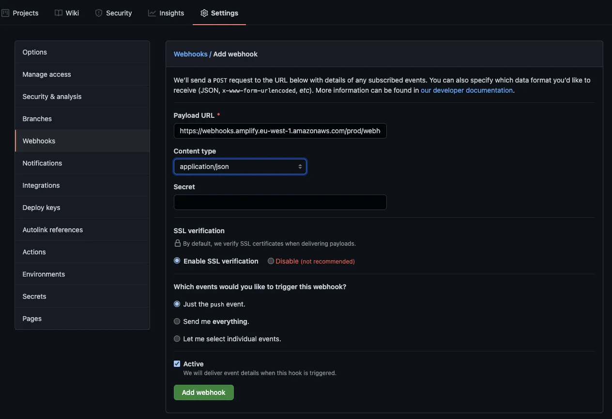

This tutorial includes guidance for three different scenarios in your GitHub administration:

1. when your repo is in your personal account;
2. when your app is under a GitHub Org and admins grant you the permissions you need; and
3. when your repo is under a GitHub Org and admins do NOT grant you the permissions you need.

_Pre-requisites: Relevant access and permissions for CodeCommit and Amplify. You also need a working GitHub account._

<!--truncate-->

## Migrating Your Repo

1. Open your CLI and cd into your existing CodeCommit local folder.
2. Run `git remote get-url origin` to get the external clone URL for the project you plan to migrate to GitHub.
3. Create a temporary folder by running `mkdir ../temp-migration` and open it in the CLI by running `cd ../temp-migration`.
4. Run `git clone --bare` followed by the clone URL you got in step 2. An example would be `git clone --bare <https://git-codecommit.eu-west-1.amazonaws.com/v1/repos/name-of-your-codecommit-directory>`.

<br/>

:::note Educational note

The flag `--bare` is a way to fully clone your repo while cutting all its ties with the remote (in CodeCommit, in this case). You still get all your branches, tags and everything, but the cloned repo is completely independent from the remote.
:::

<br/>

5. Create a new GitHub repo. To prevent issues, don’t add any README, .gitignore or anything. After you click “Create repo”, the only thing you should do is to copy the external clone URL as shown below. Don’t run any git init, fist commit or anything. Just copy the relevant path as shown below.

<br/>


<br/>

6. Back to your terminal, cd into your bare git repo by running `cd name-of-your-codecommit-directory.git` and run `git push --mirror` followed by the clone path you got in step 5. In my case, it will be `git push --mirror <https://github.com/my-username/my-project.git>`.

That’s it, migration is complete now.

### Confirm

To confirm all went well, go back to GitHub and refresh the page. You’ll see that your repo will be there as expected, including all your commit history, branches and everything. To start working on your migrated GitHub repo, simply clone it and get on with business as usual :)

### Clean up

If you followed the instructions strictly, now it’s time to delete your temporary folder. Go back to your terminal and run `cd ../.. and rm -rf temp-migration`. If you used your OS’s tmp folder instead, skip this step.

## Rewiring your Amplify Pipeline

Now that you migrated the code to GitHub, how do you leverage your already existing Amplify pipeline that was linked to the CodeCommit repo?

### Run  the `update-app` command
```
AWS_PROFILE=YOUR_PROFILE AWS_DEFAULT_REGION=YOUR_REGION aws amplify update-app --app-id AMPLIFY_APP_ID --repository REPOSITORY_URL --access-token ACCESS_TOKEN
```
`AMPLIFY_APP_ID`: To find your app id, go to the Amplify console. Under App settings, click General and look for the App ARN. The app id should be the alphanumeric string at the very end of the ARN. You can find it in your Amplify console: App settings > General. The id is shown as “REDACTED” in the screenshot below:

<br/>



<br/>

`REPOSITORY_URL`: It’s the one you got in the step 5 of the migration.
`ACCESS_TOKEN`: The access token is s a Personal Access Token that you can generate in GitHub. Beware that this token has to be generated by the GitHub repo owner.

### Re-authenticate your Amplify app

:::tip Real life XP

Companies can be very strict about the GitHub Apps they approve. If you get blocked because your admins, for whatever reason, won't approve the Amplify App, jump to the section ["The Webhook Approach"](#the-webhook-approach).
:::

Now you can reconnect your app. In the same page you got your ARN, if you look above the ARN you’ll find a button “Reconnect repository”. When you click it, you’ll be directed to the Oath flow in GitHub.
- **If the migrated repo is NOT under an Organization**, you can click the “Authorize aws-amplify-console” button. You’ll be redirected to the Amplify console, and once there, click again the reconnect repository, select the relevant repo and off you go! Enjoy!
- **If the migrated repo is under your Organization**, you can request the OAuth permission to the Amplify App by clicking a button. It will show a request pending message until your admin approves it (you’ll receive an email when they do).

<br/>


<br/>

Once Oauth is granted, go back to your Amplify app and click Reconnect repository again. You'll be shown repos both from your org and from your own account to choose from. Select the relevant one and have fun with your new migrated repos!

### The Webhook Approach

An alternative to using the Amplify GitHub App is to create an incoming webhook in Amplify instead.
To do that, under App settings, select Build settings nd click Create Webhook (both shown in orange below).

<br/>



<br/>

In the pop-up, type in a name and select a branch to build. Your new webhook will show in the Amplify interface. Copy its URL, we’ll use it in GitHub.

<br/>



<br/>

Now go back to your migrated GitHub repo, select Settings > Webhooks and click the button Add webhook.

<br/>



Workaround completed.

### Caveats of the Webhook Approach

If you go down the webhook path, be mindful that:

- If you need to connect multiple branches to Amplify, you need to create a webhook in Amplify to each of them, and add each to GitHub, one by one. If you feel tempted to automate it, have a chat to your GitHub Org admin to clear up how the OAuth permission for the Amplify App can be done. Automation in this end is an overkill and waste of time.
- Any git push will trigger the webhook in every single frontend deployment in your Amplify. In other words, if you have the branches “main”, “release”, “dev”, “feature/a”, and “feature/b”, every time your colleague pushes his changes in “feature/b” to GitHub, the pipeline will be triggered for all the five branches.


Hope this was helpful, see you!
